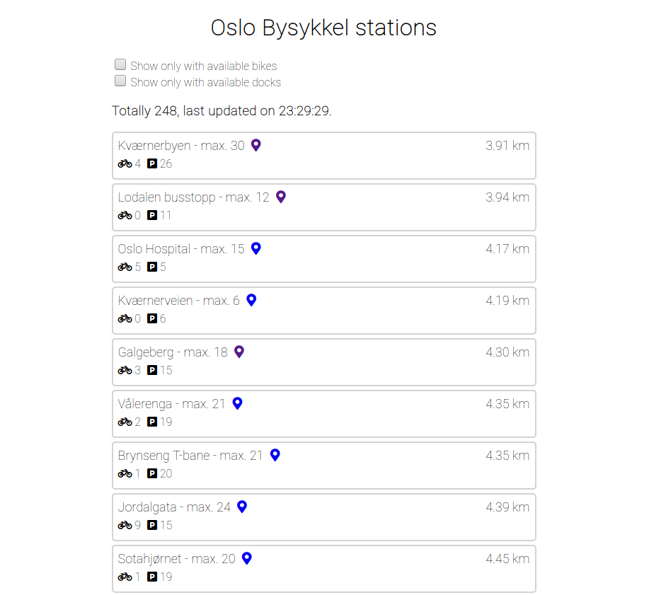

# oslo-bysykkel

Hello! This is a small webapp made by me, Igor Orlov, on the 13. january for Oslo Origo.

It shows city bike stations in Oslo, Norway in real time and their bike/dock availability.

Completely based on the following open API (Norwegian!): https://oslobysykkel.no/apne-data/sanntid

Technology stack is vanilla HTML/CSS/JS packed by Webpack and running by node (express.js).

Use `npm run dev` in root directory for dev run (supports hot reload). Or `npm run start`.

Use `npm run build` for production build.

Use `npm run test` to run tests.

---

The following endpoints were used:

https://gbfs.urbansharing.com/oslobysykkel.no/station_information.json

https://gbfs.urbansharing.com/oslobysykkel.no/station_status.json

---

Known issues:
1. Favicon not displayed in dev mode.
2. Single-file JS, didn't manage to split into ES6 modules in reasonable amount of time (something with Webpack config).

---
### Preview

